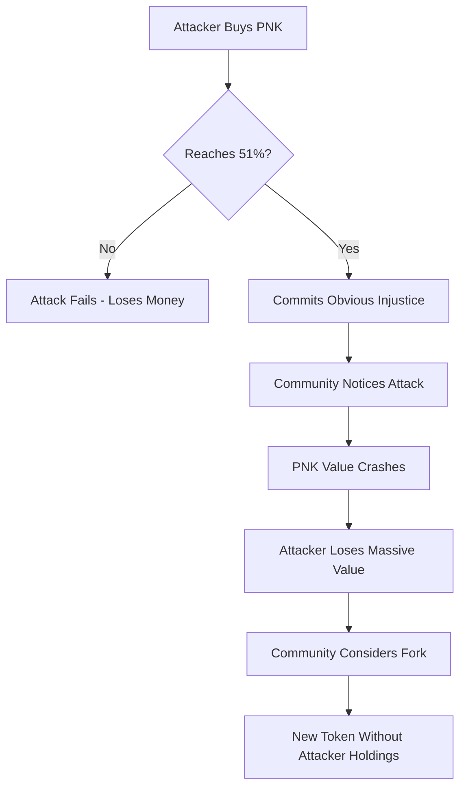

# PNK Token

## Contract Information

**📍 PNK Token Contract Address (Ethereum Mainnet):**  
[`0x93ed3fbe21207ec2e8f2d3c3de6e058cb73bc04d`](https://etherscan.io/token/0x93ed3fbe21207ec2e8f2d3c3de6e058cb73bc04d)

**📊 Total Supply:** 764,626,704 PNK

*The supply can only be modified by the Kleros community through a DAO governance vote.*

## Where to Buy PNK

### DEX Aggregators (Large Trades)
- 🔼 **[ParaSwap](https://paraswap.io/#/)** - Best rates across multiple DEXs
- 🦓 **[1inch](https://1inch.exchange/#/)** - Optimal routing and gas efficiency

### Decentralized Exchanges (Medium Trades)
- 🦄 **[Uniswap](https://app.uniswap.org/#/swap?inputCurrency=ETH&outputCurrency=0x93ed3fbe21207ec2e8f2d3c3de6e058cb73bc04d)** - Leading Ethereum DEX
- 🍣 **[SushiSwap](https://app.sushi.com/swap?inputCurrency=ETH&outputCurrency=0x93ed3fbe21207ec2e8f2d3c3de6e058cb73bc04d)** - Community-driven DEX
- ⚖️ **[Balancer](https://balancer.exchange/#/swap)** - Automated portfolio manager

### Layer 2 Solutions (Small Trades)
- 🔷 **[DeversiFi](https://app.deversifi.com)** - Gas-free trading on StarkEx

### Centralized Exchanges (Fiat Onramp)
- 🍃 **[Bitfinex](https://www.bitfinex.com/t/PNKETH)** - PNK/ETH trading
- 🚪 **[Gate.io](https://www.gate.io/trade/PNK_USDT/?ch=en_sm_0421)** - PNK/USDT pair
- 🆗 **[OKEx](https://www.okex.com/markets/spot-info/pnk-usdt)** - Multiple trading pairs

### Credit Card Purchase
- 🛡️ **[Guardarian](https://guardarian.com)** - Direct PNK purchase with credit card

## What is PNK?

PNK serves two primary functions in the Kleros ecosystem:

### 🗳️ Governance Rights
- Vote on governance decisions across the Kleros platform
- Participate in protocol upgrades and parameter changes
- Influence court creation and policy updates
- Shape the future direction of the ecosystem

### ⚖️ Jury Participation
- Stake PNK to become eligible as a juror
- Higher stakes increase chances of selection
- Earn fees and coherence rewards for honest voting
- Choose specialized courts based on expertise

## Token Origins: Pinakions

The PNK ticker comes from **"Pinakions"** - small bronze plates used in Ancient Athens. Citizens' names were written on these plates and inserted into a randomizing machine that selected participants for juries and civil service roles.

This historical reference reflects Kleros' mission to democratize justice through random jury selection.

## How PNK Works in Kleros Court

### Jury Selection Process

1. **Staking**: PNK holders stake tokens in specific courts
2. **Random Selection**: For each dispute, random PNK are drawn from staked tokens
3. **Jury Formation**: Holders of selected tokens become jurors
4. **Appeal Process**: Larger juries are formed for appeals, requiring more PNK

### Economic Incentives

- **Coherent Jurors**: Earn arbitration fees + coherence rewards
- **Incoherent Jurors**: Lose staked tokens to coherent jurors
- **Court Specialization**: Higher rewards in specialized courts requiring expertise

## Why Kleros Needs a Native Token

### 🛡️ Sybil Attack Protection

PNK provides crucial protection against [Sybil attacks](https://en.wikipedia.org/wiki/Sybil_attack):

- Attackers need 51% of staked tokens to reliably control outcomes
- Requires substantial economic resources to mount attacks
- Economic barriers scale with the value at stake

### 🔒 Attack Resistance Mechanisms

#### 1. Market Liquidity Defense
- As attackers buy PNK, it becomes scarce
- Each additional token costs progressively more  
- May not find 51% of PNK for sale at any time
- Much stronger defense than using ETH or other external tokens

#### 2. Economic Cost of Attacks
- Successful attacks damage Kleros credibility
- PNK value decreases, causing attacker losses
- Self-defeating economic incentives
- Attackers lose money even if attack succeeds

#### 3. Community Fork Protection
- **Last resort defense**: Community can fork to remove attacker holdings
- Market decides which version of PNK to use
- Similar to Augur's ultimate appeal mechanism
- Not possible with external tokens like ETH

### Attack Scenario Analysis

## Token Economics

### Current Distribution

- **Team Members**: 18%
- **First Token Sale Round**: 16% 
- **Airdrop**: 4%
- **Subsequent Rounds & Juror Incentives**: 50%
- **Kleros Cooperative Development Reserve**: 12%

### Utility Mechanisms

- **Staking Rewards**: Earn fees for jury service
- **Governance Power**: Influence protocol decisions
- **Court Access**: Required for jury participation
- **Appeal Crowdfunding**: Support correct decisions

## Testnet Faucets

Get testnet PNK for development and testing:

:::tip Testnet PNK Faucets
Call the `request` function to receive 10,000 testnet PNK (once per address):

- **[Goerli PNK Faucet](https://goerli.etherscan.io/address/0x4B89e798B10478A839Ea0Abcf86C4B94A3C782A4#writeContract)** - Currently supported
- **[Kovan PNK Faucet](https://kovan.etherscan.io/address/0x4e95b2e0ecb3bd394e1dddd775504820a746d3bd#writeContract)** - Legacy support

*Contact the Kleros team if you need faucets on other testnets.*
:::

## Getting Started with PNK

### For Jurors
1. **[Buy PNK](#where-to-buy-pnk)** from your preferred exchange
2. **[Stake in Court](https://court.kleros.io)** - Choose courts matching your expertise
3. **Wait for Selection** - Random selection for disputes
4. **Vote and Earn** - Coherent voting earns rewards

### For Governance Participants
1. **Hold PNK** in your wallet
2. **Join [Forum Discussions](https://forum.kleros.io)** - Stay informed
3. **Vote on [Snapshot](https://snapshot.org/#/kleros.eth)** - Participate in governance
4. **Monitor [Governor](/products/governor)** - Track implementation

## Security Best Practices

- **Use Hardware Wallets** for large PNK holdings
- **Never share private keys** or seed phrases
- **Verify contract addresses** before interacting
- **Keep software updated** and use official interfaces
- **Understand risks** before staking or trading

## Community Resources

- **📊 [KlerosBoard](http://klerosboard.com)** - Court analytics and statistics
- **📈 [Token Analytics](https://www.coingecko.com/en/coins/kleros)** - Price and market data
- **🔗 [Etherscan](https://etherscan.io/token/0x93ed3fbe21207ec2e8f2d3c3de6e058cb73bc04d)** - On-chain token information
- **💬 [Discord](https://discord.gg/MhXQGCyHd9)** - Community discussions
- **🗳️ [Governance Forum](https://forum.kleros.io)** - Proposal discussions

---

## Learn More

- **[Court System](/products/court/)** - How to become a juror
- **[Governance](/governance)** - Participate in protocol decisions
- **[Famous Cases](/products/court/famous-cases)** - See PNK incentives in action
- **[White Paper](https://kleros.io/whitepaper.pdf)** - Technical details of the token economics

*PNK is more than a token - it's the foundation of decentralized justice.*