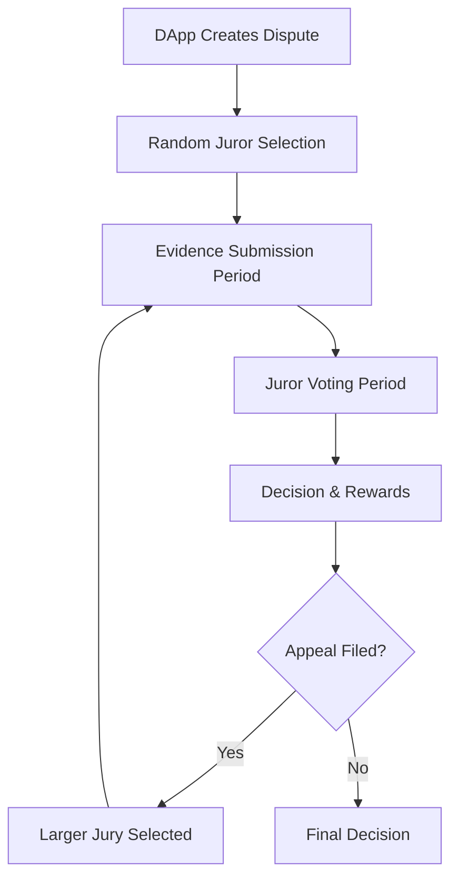

# Kleros Court

**⚖️ [Launch Kleros Court App](https://court.kleros.io) ⚖️**

**Kleros Court** is the core engine of the Kleros ecosystem - a dispute resolution protocol that provides arbitration for subjective conflicts that smart contracts cannot address automatically.

It works by having a set of jurors randomly drawn for each dispute who vote to ensure a fair verdict based on evidence and established policies.


## How Kleros Court Works

### The Two Sides of Kleros

Kleros operates with two distinct sides:

- **Arbitrator Side** - The Kleros Court system itself
- **Arbitrable Side** - DApps and contracts that send disputes to Kleros


All disputes from various DApps flow into the Kleros Court system for resolution by randomly selected jurors.

### The Dispute Resolution Process



#### Step 1: Dispute Creation
- A DApp sends a dispute to Kleros Court
- The system assigns it to an appropriate specialized court
- Jurors are randomly selected from those staked in that court

#### Step 2: Evidence Period
All interested parties can submit evidence:
- **Disputing parties** - Submit their arguments and proof
- **Jurors** - Can request additional information
- **External parties** - May provide relevant context
- **Challengers** - Can dispute evidence validity

#### Step 3: Voting Period
Jurors vote on the dispute with three possible options:
- **✅ Yes** - Support one side of the dispute
- **❌ No** - Support the other side of the dispute  
- **🚫 Refuse to Arbitrate** - For invalid, illegal, or unacceptable cases

#### Step 4: Decision & Appeals
- **Coherent jurors** (those voting with majority) earn rewards
- **Incoherent jurors** lose their staked tokens
- Parties can appeal to a larger jury if unsatisfied


## Court Structure & Specialization

### Hierarchical Court System

Kleros uses a tree structure of specialized courts with the **General Court** as the root:

```
General Court (Root)
├── Blockchain Courts
│   ├── Technical Issues
│   ├── Token Listing
│   └── DeFi Disputes
├── Content Courts  
│   ├── Content Moderation
│   ├── Translation
│   └── Curation
└── Real World Courts
    ├── Insurance
    ├── E-commerce
    └── Employment
```

### Why Specialized Courts?

- **Expertise** - Jurors with relevant knowledge for specific dispute types
- **Efficiency** - Faster resolution with domain experts
- **Quality** - Better decisions from specialized understanding
- **Incentives** - Higher rewards for specialized knowledge

### Court Selection

When creating an arbitrable contract:
- **Software Development** disputes → Software Development Court
- **Insurance** disputes → Insurance Court  
- **Content Moderation** disputes → Content Moderation Court
- **General** disputes → General Court (fallback)

## Key Features

### 🎯 Random Jury Selection
- Cryptographically secure randomness
- Proportional to PNK stake in relevant court
- Cannot be gamed or predicted

### ⚡ Efficient Process
- Clear timelines for each phase
- Automated reward distribution
- Appeal mechanisms for accuracy

### 🌐 Global Accessibility  
- 24/7 availability
- No geographical restrictions
- Pseudonymous participation

### 💰 Economic Incentives
- Jurors earn fees for coherent voting
- Losing parties pay arbitration costs
- Crowdfunded appeals enable fair access

### 🔒 Security & Transparency
- All evidence and votes are public
- Immutable record on blockchain
- Appeal system prevents manipulation

## Court Analytics

Track Kleros Court performance and statistics:

- **📊 [KlerosBoard](http://klerosboard.com)** - Comprehensive court analytics
- **📈 [Court Analytics](/integrations/analytics)** - Detailed metrics and insights
- **⚖️ [Live Cases](https://court.kleros.io)** - Current active disputes

## Getting Started

### For Jurors 🧑‍⚖️

Ready to become a juror and earn rewards for fair decisions?

1. **[Read the Juror Tutorial](/products/court/juror-tutorial)** - Learn the complete process
2. **[Understand Court Selection](https://court.kleros.io)** - Choose courts matching your expertise
3. **[Stake PNK](/pnk-token)** - Purchase and stake tokens to join
4. **[Take the Juror Quiz](/quizzes/juror-quiz)** - Test your knowledge

### For Developers 👩‍💻

Want to integrate dispute resolution into your DApp?

1. **[Smart Contract Integration](/integrations/dispute-resolution/smart-contract-integration)** - Technical implementation
2. **[Code Examples](/developers/examples/)** - Sample contracts and integrations
3. **[ERC-792 Standard](/developers/arbitration-standard/erc-792)** - Arbitration protocol
4. **[Deployment Addresses](/developers/deployment-addresses)** - Live contract addresses

### For Businesses 🏢

Interested in using Kleros for your dispute resolution needs?

1. **[Enterprise Solutions](/products/enterprise)** - Custom implementations  
2. **[Integration Types](/integrations/overview)** - Choose your integration model
3. **[Policy Writing Guide](/integrations/policy-writing-guide)** - Create clear dispute policies
4. **[Case Studies](/products/court/famous-cases)** - See real-world examples

## Advanced Topics

### Appeal System
Learn how appeals work to ensure accurate decisions:
- **[Appeal Process](/products/court/dispute-process#appeals)** - Step-by-step appeal flow
- **[Crowdfunded Appeals](/faq#how-does-the-appeal-system-work-doesnt-this-favor-wealthy-parties)** - Community-supported appeals
- **[Economic Incentives](/pnk-token#economic-incentives)** - Why appeals lead to truth

### Court Governance
Understand how courts are managed and evolved:
- **[Court Creation](/governance)** - How new courts are established
- **[Policy Updates](/integrations/policy-writing-guide)** - Evolving dispute resolution rules
- **[Community Governance](/governance)** - Decentralized decision making

### Security & Game Theory
Dive deep into the cryptoeconomic design:
- **[Attack Resistance](/pnk-token#attack-resistance-mechanisms)** - How Kleros prevents manipulation
- **[Incentive Alignment](/faq#how-do-you-ensure-jurors-review-evidence-instead-of-just-voting-randomly)** - Why jurors vote honestly
- **[Credible Neutrality](/products/court/credible-neutrality)** - Unbiased dispute resolution

---

## Next Steps

- **🎓 [Learn to be a Juror](/products/court/juror-tutorial)** - Complete tutorial for new jurors
- **⚖️ [See Famous Cases](/products/court/famous-cases)** - Notable disputes resolved
- **📊 [Explore Court Analytics](/integrations/analytics)** - Data and insights
- **🔗 [Smart Contract Integration](/integrations/dispute-resolution/smart-contract-integration)** - Technical implementation

*Kleros Court democratizes access to justice through decentralized dispute resolution.*