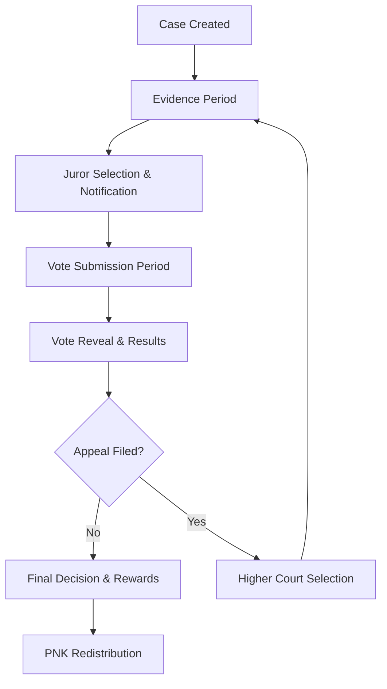

# Kleros Juror Tutorial

Welcome to the Kleros Juror Starter Kit! This comprehensive guide will walk you through everything you need to know to become a successful juror in the Kleros Court system.

**🎯 No registration required • 🔒 No personal information needed • 💰 Earn rewards for fair decisions**

## Getting Started

### What You'll Need

Before becoming a juror, ensure you have:

#### 1. 🦊 MetaMask Wallet
- **[Install MetaMask](https://metamask.io/)** - Browser extension or mobile app
- Set up your wallet and secure your seed phrase
- Connect to Ethereum Mainnet

#### 2. 💰 PNK Tokens  
- **[Buy PNK](/pnk-token#where-to-buy-pnk)** - Purchase from exchanges or DEXs
- **Minimum amounts vary by court** (typically 1,000-5,000 PNK)
- Keep some ETH for gas fees

#### 3. ⛽ ETH for Gas
- Small amount for transaction fees
- Needed for staking, voting, and unstaking operations

### Quick Start: Buy PNK

The easiest way to get PNK:

1. **Visit [Kleros Court](https://court.kleros.io)**
2. **Click "Buy PNK"** in the top right
3. **Choose your preferred exchange** from the list
4. **Purchase PNK** and transfer to your MetaMask wallet

## Becoming a Juror

### Step 1: Choose Your Court

Different courts require different expertise levels:

#### 🎓 **Beginner Courts**
- **Onboarding Court** - Perfect for new jurors
- **General Court** - Basic disputes, minimal specialization needed
- **Minimum stake**: ~1,000 PNK

#### 🔗 **Blockchain Courts**  
- **Blockchain Non-Technical** - Basic blockchain knowledge required
- **Token Listing** - Understanding of token economics
- **Minimum stake**: ~1,600 PNK

#### 🌐 **Language Courts**
- **English Court** - English language expertise
- **Spanish Court** - Spanish language expertise  
- **French Court** - French language expertise
- **Minimum stake**: ~3,200 PNK

#### ⚖️ **Specialized Courts**
- **Curation** - Content and data verification
- **Insurance** - Insurance dispute knowledge
- **Marketing** - Advertising and promotional content
- **Minimum stake**: varies significantly

### Step 2: Navigate to Courts

1. **Go to [Kleros Court](https://court.kleros.io)**
2. **Click "Courts"** in the header
3. **Select "Join a Court"**

### Step 3: Explore Court Options

Browse the court tree structure:
- **Start with General Court** (always selected by default)
- **Click down the tree** to see subcourts
- **Read court descriptions** and requirements carefully
- **Check minimum stake amounts** and potential rewards

### Step 4: Stake Your PNK

Once you've chosen your court:

1. **Click the "Stake" button** for your chosen court
2. **Enter the amount** of PNK you want to stake
3. **Review the details**:
   - Minimum stake requirement
   - Potential rewards per case
   - PNK locked per vote (varies by court)
4. **Confirm transaction** in MetaMask
5. **Pay gas fee** to complete staking

:::info Important Staking Rules
**When you stake in a court, you are automatically staked in all parent courts up to the General Court.** This is necessary for the appeal system to function properly.
:::

### Step 5: Wait for Jury Selection

After staking:
- **Your stake is active** immediately after transaction confirmation
- **Selection is random** but proportional to your stake
- **Higher stakes = higher chance** of being selected
- **Be patient** - selection depends on case volume

Track your status on the **Courts page** where you'll see:
- **Your staked amount** in each court
- **Potential rewards** for coherent voting
- **Court statistics** and activity levels

## When You're Selected as a Juror

### Getting Notified

**Enable notifications** to never miss a case:
1. **Click the email icon** in the menu header
2. **Enter your email address**
3. **Receive notifications** for:
   - New cases where you're selected
   - Case state changes
   - Appeal notifications
   - Reward distributions

### Reviewing Your Case

When selected, you'll see the case in **"My Cases"** section:

1. **Click "See Details"** to review the case
2. **Read all evidence** submitted by parties
3. **Review court policy** and guidelines
4. **Consider all arguments** carefully

## The Voting Process

### Understanding Your Options

For each case, you have **three voting options**:

#### ✅ **Option A / Yes**
- Support the first party's position
- Vote when evidence clearly supports this side

#### ❌ **Option B / No**  
- Support the second party's position
- Vote when evidence clearly supports this side

#### 🚫 **Refuse to Arbitrate**
- Use in specific situations only:
  - Both parties engaged in illegal activities
  - Content violates moral standards
  - Insufficient information to make decision
  - Court policy explicitly requires refusal

:::warning Refuse to Arbitrate
Only use "Refuse to Arbitrate" when court guidelines or policies explicitly indicate you should. Improper use may result in loss of staked tokens.
:::

### Making Your Decision

**Review Process:**
1. **📋 Read the case description** thoroughly
2. **📄 Examine all evidence** from both parties  
3. **📜 Check court policies** and guidelines
4. **⚖️ Apply policy to evidence** objectively
5. **🗳️ Cast your vote** before deadline

**Best Practices:**
- ✅ Base decisions on evidence and policy
- ✅ Vote coherently with other honest jurors
- ✅ Submit detailed justification
- ❌ Don't vote randomly or emotionally
- ❌ Don't ignore court guidelines

## Understanding Rewards & Penalties

### Coherent Voting Rewards

**When you vote with the majority:**
- **Receive arbitration fees** for your work
- **Keep your staked PNK** safe
- **Get coherence rewards** from incoherent jurors
- **Build reputation** in the court

### Incoherent Voting Penalties

**When you vote against the majority:**
- **Lose part of your stake** to coherent jurors
- **No arbitration fees** earned
- **Opportunity cost** of time spent

### Economic Incentives

This system ensures:
- **Honest jurors are rewarded** financially
- **Random voting is punished** economically  
- **Expertise is incentivized** through specialization
- **Long-term participation** is profitable

## The Complete Court Process

### Timeline Overview

1. **Evidence Period** (typically 3-7 days)
   - Parties submit evidence and arguments
   - Anyone can contribute relevant information

2. **Voting Period** (typically 3-4 days)  
   - Jurors review evidence and vote
   - Secret voting to prevent influence

3. **Appeal Period** (typically 3-7 days)
   - Parties can appeal to larger jury
   - Appeal fees must be paid

4. **Reward Distribution** (automatic)
   - Coherent jurors receive rewards
   - Incoherent jurors lose stakes

## Advanced Juror Topics

### Court Specialization Strategy

**Building Expertise:**
- Start with **General/Onboarding** courts
- Learn from experienced jurors
- Gradually move to **specialized courts**
- Focus on areas of personal expertise

**Maximizing Returns:**
- **Higher specialization** = higher rewards
- **Consistent coherent voting** builds reputation
- **Multiple court participation** diversifies income
- **Larger stakes** increase selection chances

### Managing Multiple Courts

**Portfolio Approach:**
- **Diversify across courts** to increase case volume
- **Balance risk vs reward** (specialized vs general)
- **Monitor court activity** and adjust stakes
- **Seasonal patterns** may affect different courts

### Appeal System Understanding

**How Appeals Work:**
- **Losing party** can challenge decision
- **Jury size increases** significantly (3x typically)
- **New jurors selected** from parent court
- **Appeal fees** fund larger jury rewards

**Appeal Strategy:**
- **Vote consistently** across all rounds
- **Higher courts** have more experienced jurors
- **Final decisions** are more reliable

## Troubleshooting & Support

### Common Issues

**Not Getting Selected?**
- ✅ Increase your stake amount
- ✅ Try different courts with more activity
- ✅ Be patient - selection is random
- ✅ Check if your stake is active

**Lost PNK After Voting?**
- ✅ Review your voting decisions
- ✅ Check if you voted coherently  
- ✅ Learn from the case for future votes
- ✅ Consider it part of the learning process

**Technical Problems?**
- ✅ Check MetaMask connection
- ✅ Ensure sufficient ETH for gas
- ✅ Try refreshing browser
- ✅ Clear browser cache

### Getting Help

- **💬 [Discord](https://discord.gg/MhXQGCyHd9)** - Real-time community support
- **📱 [Telegram](https://t.me/kleros)** - Community discussions
- **📋 [Forum](https://forum.kleros.io)** - Detailed help and discussions
- **📚 [Documentation](/faq)** - Comprehensive FAQ

## Success Tips for New Jurors

### 🎯 **Start Small**
- Begin with smaller stakes to learn
- Focus on one or two courts initially
- Gain experience before increasing investment

### 📚 **Study Court Policies**
- Read guidelines thoroughly
- Understand each court's requirements
- Learn from past cases and decisions

### 🤝 **Join the Community**
- Participate in Discord discussions  
- Learn from experienced jurors
- Stay updated on court changes

### ⚖️ **Vote Responsibly**
- Base decisions on evidence, not emotion
- Take time to review all materials
- Consider the long-term impact of decisions

### 💡 **Learn Continuously**
- Analyze your voting results
- Understand why decisions were made
- Adapt your strategy based on outcomes

---

## Ready to Start?

1. **🦊 [Set up MetaMask](https://metamask.io/)** if you haven't already
2. **💰 [Buy PNK](/pnk-token#where-to-buy-pnk)** from your preferred exchange  
3. **⚖️ [Visit Kleros Court](https://court.kleros.io)** and choose your court
4. **🎯 [Take the Juror Quiz](/quizzes/juror-quiz)** to test your knowledge
5. **💬 [Join our Discord](https://discord.gg/MhXQGCyHd9)** to connect with other jurors

**Important reminder:** Always review court policies carefully before voting. Your decisions impact real disputes and people's lives.

*Welcome to the future of decentralized justice! See you in court! ⚖️*